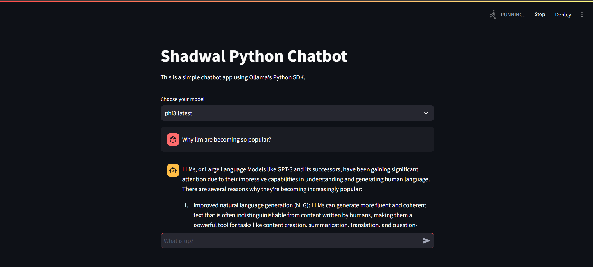

# Steps to create chat app using ollama

- Install ollama
- `ollama run phi3`
- Use Open WebUI to interact with llm and running them on docker
- ` docker run -d -p 3000:8080 --add-host=host.docker.internal:host-gateway -v open-webui:/app/backend/data --name open-webui --restart always ghcr.io/open-webui/open-webui:main`
- Now after that just install necessary packages create virtual environment
- To run chat app use `streamlit run chat_app.py`
